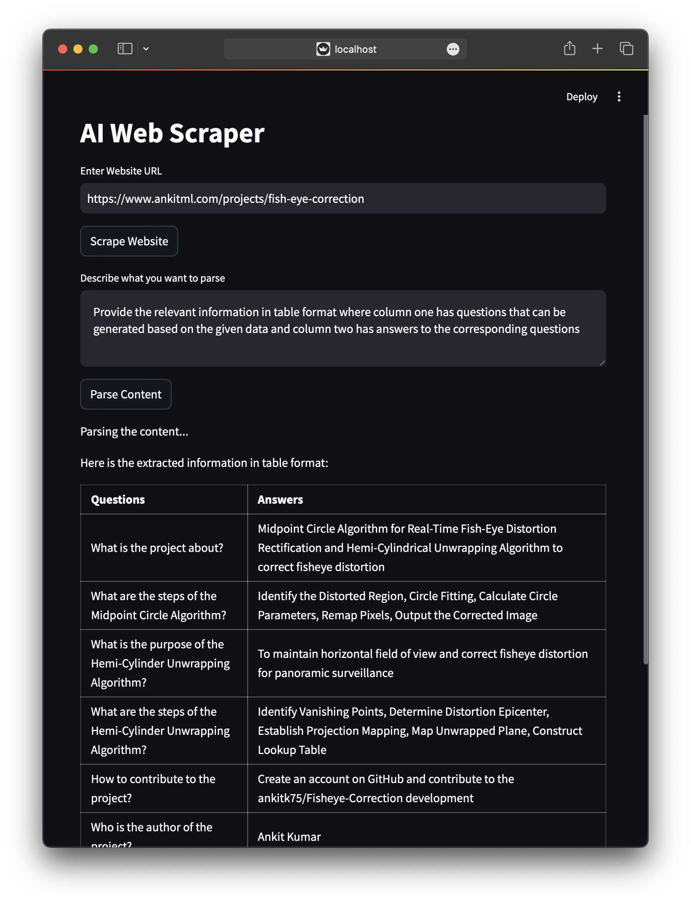

# AI Web Scraper with Fine-Tuned LLaMA 3.1



## Project Overview

This project involves developing an AI-driven web scraper that extracts and structures information from websites based on user inputs. The scraper utilizes advanced Natural Language Processing (NLP) capabilities through a fine-tuned LLaMA 3.1 model, specifically fine-tuned using the Supervised Fine-Tuning (SFT) technique with LoRA and the Unsloth library. The application features a user-friendly Streamlit interface, allowing users to enter website URLs, specify content extraction parameters, and receive structured data outputs.

## Tech Stack

- **Python**: Main programming language used for the entire project.
- **Selenium**: For automated browsing and scraping of web pages.
- **BeautifulSoup**: For parsing HTML and extracting content.
- **Streamlit**: To build the interactive web application interface.
- **LLaMA 3.1 Model**: For parsing and processing scraped content using NLP.
- **LoRA (Low-Rank Adaptation)**: Fine-tuning technique applied to the LLaMA model.
- **Unsloth Library**: Used to fine-tune LLaMA 3.1 model efficiently.
- **LangChain-Ollama**: For structured data extraction and NLP parsing.

## Features

- **Automated Web Scraping**: Enter a URL, and the application automatically scrapes data from the website.
- **NLP-Driven Content Parsing**: Extract and structure specific information using a fine-tuned LLaMA 3.1 model.
- **Streamlit UI**: Simple and intuitive user interface for seamless interaction.
- **Customizable Data Extraction**: Users can define the parsing parameters to control the type of data extracted.

## Project Structure

- `scrape.py`: This script uses Selenium and BeautifulSoup to scrape the website content. The scraped content is cleaned and pre-processed for further analysis.
  
- `parse.py`: Implements the `parse_with_ollama` function, utilizing the LLaMA 3.1 model fine-tuned via LoRA. This script processes DOM content based on user-defined parsing instructions, converting raw HTML into structured data.

- `main.py`: The main entry point for the application, built using Streamlit. It integrates the scraping and parsing modules to provide a unified interface where users can input URLs, define extraction parameters, and view results.

## How It Works

1. **Web Scraping**: The `scrape.py` script collects data from the specified website. Selenium is used for automating the browser interactions, while BeautifulSoup cleans and extracts the main body content.

2. **Content Parsing with LLaMA 3.1**: The `parse.py` script uses a fine-tuned LLaMA 3.1 model to interpret and structure the scraped data. Fine-tuning was performed using the LoRA technique via the Unsloth library to enhance model adaptability and performance.

3. **User Interaction through Streamlit**: The `main.py` script sets up a user-friendly interface where the user inputs a URL, describes what information to extract, and gets structured outputs.

## Installation and Setup


1. **Install Dependencies**: Ensure you have Python installed. Then, install all required dependencies:

   ```bash
   pip install -r requirements.txt
    ```
   
2. **Clone the Repository**

   ```bash
   git clone https://github.com/ankitk75/AI-Web-Scraper-Chatbot-using-Llama3.1.git
   cd AI-Web-Scraper-Chatbot-using-Llama3.1
    ```

3. **Run the Application:** Start the Streamlit application:

   ```bash
   streamlit run main.py
    ```
